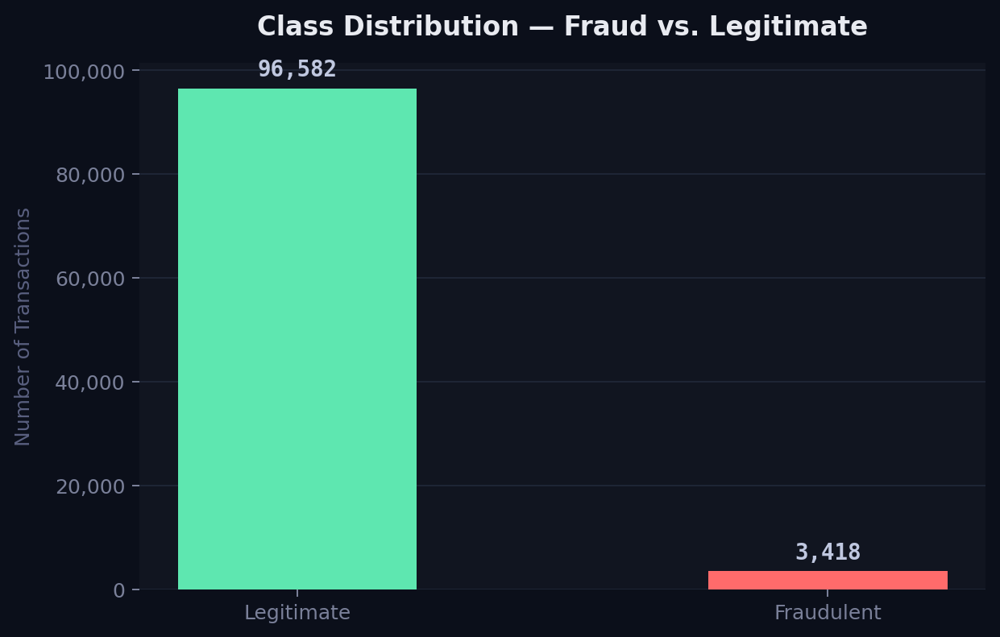
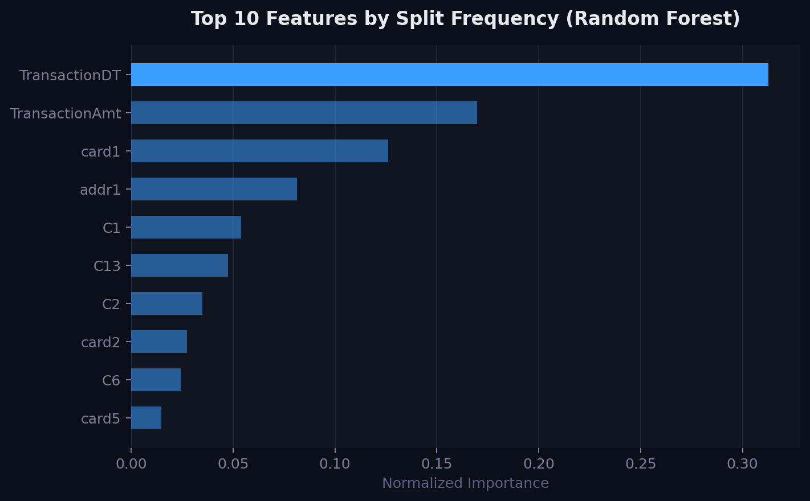
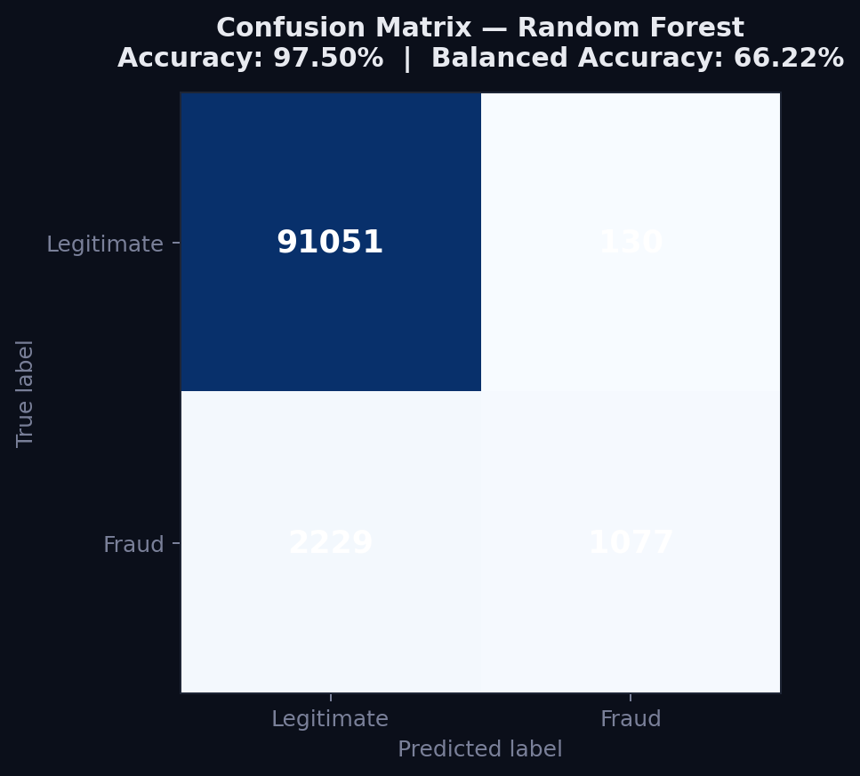

# Fraud Detection — Decision Tree and Random Forest from Scratch

Fraud detection classifier using a custom Decision Tree and Random Forest 
built from scratch in Python, trained on the IEEE-CIS Fraud Detection 
dataset from Kaggle.

## How to Run
1. Create a virtual environment: `python -m venv venv`
2. Activate it: `venv\Scripts\activate` (Windows) or `source venv/bin/activate` (Mac/Linux)
3. Install dependencies: `pip install -r requirements.txt`
4. Download the dataset from [Kaggle](https://www.kaggle.com/competitions/ieee-fraud-detection) and place `train.csv` and `test.csv` inside a `data/` folder
5. Run: `python classifier.py`

## File Manifest
1. `classifier.py` — Main executable. Includes all code for data preprocessing, model training, evaluation, and visualization.
2. `requirements.txt` — All required packages and versions.

## Results

| Model | Accuracy | Balanced Accuracy |
|---|---|---|
| Decision Tree | 97.15% | 63.69% |
| Random Forest | **97.50%** | **66.22%** |

## Usage
This pipeline can be applied to any binary classification problem with 
class imbalance. The model was trained on a 100,000 sample subset of 
the full 590,540 row dataset due to the computational cost of the 
from-scratch implementation.

